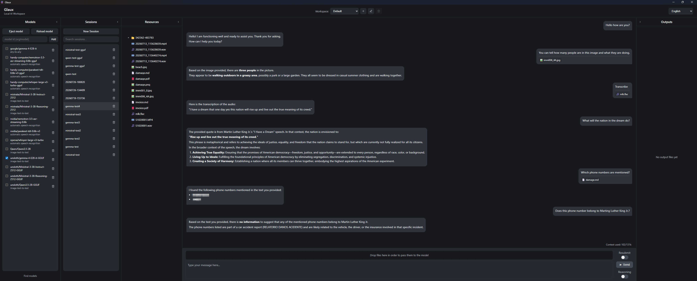

<p align="center">
  
</p>

# Glaux

Glaux is a **local AI workspace** for Windows, macOS, and Linux. It runs Hugging Face [Transformers](https://github.com/huggingface/transformers) models and GGUF models (via [llama.cpp](https://github.com/ggml-org/llama.cpp) for chat, and [transcribe.cpp](https://github.com/handy-computer/transcribe.cpp) for ASR) on your machine through a desktop UI — no cloud API required for inference.

It is designed to be as **user-friendly and accessible as possible**: you do not need any prior knowledge or experience running AI models. Pick a model from the [Hub](https://huggingface.co/models), download it through Glaux, and start chatting. Attach images, audio, video, or PDFs (parsed into markdown) when the model supports them. All content and sessions stay on disk under your user profile.



**Windows is the primary tested platform.** macOS and Linux packaging is supported, but those builds may need community validation.

**GPU is used by default when the host supports it.** A single app build per OS ships every backend that OS can run; the engine picks CUDA, Vulkan, Metal/MPS, or CPU at runtime.


## Tested models

These models have been tested and confirmed fully working with Glaux:


| Model | Safetensors | GGUF |
| ---- | ---- | ---- |
| Gemma 4 E2B Instruct | ✓ [`google/gemma-4-E2B-it`] | ✓ [`unsloth/gemma-4-E2B-it-GGUF`] |
| Ministral 3 3B Instruct | ✓ [`mistralai/Ministral-3-3B-Instruct-2512`] | ✓ [`unsloth/Ministral-3-3B-Instruct-2512-GGUF`] |
| Ministral 3 3B Reasoning | ✓ [`mistralai/Ministral-3-3B-Reasoning-2512`] | ✓ [`unsloth/Ministral-3-3B-Reasoning-2512-GGUF`] |
| Qwen 3.5 2B | ✓ [`Qwen/Qwen3.5-2B`] | ✓ [`unsloth/Qwen3.5-2B-GGUF`] |
| Nemotron ASR streaming 0.6B<br/>(cache-aware input streaming of files supported) | ✓ [`nvidia/nemotron-3.5-asr-streaming-0.6b`] | ✓ [`handy-computer/nemotron-3.5-asr-streaming-0.6b-gguf`] |
| Parakeet TDT 0.6B v3 | ✓ [`nvidia/parakeet-tdt-0.6b-v3`] | ✓ [`handy-computer/parakeet-tdt-0.6b-v3-gguf`] |
| Whisper Large V3 Turbo | ✓ [`openai/whisper-large-v3-turbo`] | ✓ [`handy-computer/whisper-large-v3-turbo-gguf`] |

Other Hub models may work as well; safetensors support depends on the [Transformers](https://github.com/huggingface/transformers) stack, chat GGUF support depends on [llama.cpp](https://github.com/ggml-org/llama.cpp), and ASR GGUF support depends on [transcribe.cpp](https://github.com/handy-computer/transcribe.cpp).

> **Note:** Some models do not declare a pipeline_tag in their README.md. The safetensors engine defaults to text-generation if no explicit pipeline_tag is given. For full support of model capabilities add the proper pipeline_tag in the model's README.md yourself (refer to the task the model is categorized under on Hugging Face to determine the correct pipeline_tag).

### Gated models (`HF_TOKEN`)

Some Hub repos are **gated**. Glaux has no in-app Hugging Face login. `huggingface_hub` reads a token from the process environment when the Python worker starts (`engines/huggingface/engine.js` forwards `process.env`).

1. While logged in at [huggingface.co](https://huggingface.co), open the model page and accept its license.
2. Create an access token at [Hugging Face token settings](https://huggingface.co/settings/tokens) (a read-only token is enough to download).
3. Set `HF_TOKEN` in the environment **before launching** Glaux. `HUGGING_FACE_HUB_TOKEN` is also accepted by `huggingface_hub`. Do not commit the token or paste it into chat logs.

```bash
# Windows (PowerShell)
$env:HF_TOKEN="hf_your_token"

# macOS / Linux
export HF_TOKEN=hf_your_token
```

**Packaged app:** set the variable in the shell (or system environment) that starts `Glaux.exe` / the `.app` / the AppImage, then launch. Hub **model weights stay under their own licenses**; downloading a gated model does not change the Glaux MIT license.


## Features

- Local chat with Hugging Face Transformers models (PyTorch), chat GGUFs (llama.cpp `llama-server`), and ASR GGUFs (transcribe.cpp `transcribe-cli`), with **automatic GPU** (CUDA / Vulkan / Metal / MPS) and CPU fallback
- Automatic engine routing (safetensors → Transformers, ASR GGUF → transcribe.cpp, other GGUF → llama.cpp) — invisible to the user
- Model download and cache management from the Hub, including a GGUF quant-variant picker (download only the selected Q4_K_M / Q8_0 / … files)
- Multimodal inputs (images, audio, video, PDF) when the selected model supports them
- Automatic parsing of PDFs into markdown
- Audio and video transcription
- Mid-session model switching (including across engines, with chat context preserved)
- Workspace system
- Light and dark UI themes (follows the OS by default)
- Session persistence
- Context usage tracking
- Delete and export individual turns
- Markdown editor and media viewers
- Resource library and outputs browser with drag-and-drop support
- Standalone installers / archives (Electron + bundled Python + llama-server + transcribe-cli) for Windows, macOS, and Linux


## How it works

```
┌─────────────────┐     IPC      ┌──────────────────┐
│  Renderer (UI)  │ ───────────► │  Electron main   │
│  src/renderer/  │              │  src/main +      │
│                 │              │  engineManager   │
└─────────────────┘              └────────┬─────────┘
                                          │
          ┌───────────────────────────────┼───────────────────────────────┐
          ▼                               ▼                               ▼
      safetensors                   Hub downloads                 *.gguf (by tag)
  engines/huggingface           (HF model-downloader)             chat → llamacpp
(Python / Transformers)                                         ASR  → transcribecpp
```

1. **Electron** hosts the UI (`src/renderer/`) and filesystem/IPC logic (`src/main/`, `src/preload/`).
2. `engines/engineManager.js` is the only inference facade the app talks to. It routes by weight format and `pipeline_tag`.
3. The **Hugging Face engine** (`engines/huggingface/`) spawns a long-lived Python worker (`engine.py` → `worker/`) and talks JSON-RPC over stdin/stdout. It uses CUDA or MPS when Torch reports them, otherwise CPU.
4. The **llama.cpp engine** (`engines/llamacpp/`) spawns a long-lived bundled `llama-server` (dynamic CUDA/Vulkan/Metal backends) and uses its OpenAI-compatible HTTP API (chat / multimodal GGUFs).
5. The **transcribe.cpp engine** (`engines/transcribecpp/`) spawns a one-shot bundled `transcribe-cli` per transcription (`--backend auto`; ASR GGUFs, including Nemotron cache-aware streaming).
6. Models are stored under the OS app-data directory (not inside the app install). Other user data lives beside that:


| Path | Purpose |
| ---- | ------- |
| `<appData>/Glaux/preferences.json` | App preferences (active workspace, selected model, UI language/theme, UI toggles) |
| `<appData>/Glaux/Models` | Downloaded Hub model weights (shared across workspaces) |
| `<appData>/Glaux/Workspaces/<name>/Resources` | User resource library for that workspace |
| `<appData>/Glaux/Workspaces/<name>/Outputs` | Generated / exported outputs for that workspace |
| `<appData>/Glaux/Workspaces/<name>/Sessions` | Saved chat sessions for that workspace |


`<appData>` resolves to `%AppData%` on Windows, `~/Library/Application Support` on macOS, and `~/.config` on Linux.


## Requirements

### Development

- **Node.js** (npm)
- **Git** (to clone llama.cpp / transcribe.cpp into `deps/` on first native build)
- **Windows, macOS, or Linux** (packaging builds for the host OS by default)
- **Python 3.14** with the packages in `engines/huggingface/requirements.txt`
  - Or build the bundled runtime (see below) and let the app use `vendor/python`
- For GGUF inference in development:
  - Chat / multimodal: `npm run build:llamacpp` (clones a pinned [llama.cpp](https://github.com/ggml-org/llama.cpp) into `deps/llama.cpp` if missing)
  - ASR: `npm run build:transcribe` (clones a pinned [transcribe.cpp](https://github.com/handy-computer/transcribe.cpp) into `deps/transcribe.cpp` if missing)
  - Install **CMake** + a C++ toolchain (VS 2022 on Windows, Xcode CLT on macOS, build-essential on Linux)
  - On Windows/Linux, also install the **CUDA Toolkit** (`nvcc`) and **Vulkan SDK** so GPU backends are compiled into the vendor trees (not required on the end-user machine)
  - Non-WAV / video ASR prep and Hugging Face audio/video decode use ffmpeg/ffprobe from `vendor/ffmpeg` (built by `npm run build:ffmpeg`)
  - Chat GGUF video input also needs that same `ffprobe` next to ffmpeg (llama.cpp probes with ffprobe, then decodes with ffmpeg)
  - Building `vendor/ffmpeg` needs **nasm**, **meson**, **ninja**, **pkg-config**, and a C compiler. On Windows install [MSYS2](https://www.msys2.org/) MinGW64 (`mingw-w64-x86_64-gcc`, `nasm`, `meson`, `ninja`, `pkg-config`)

Optional: [uv](https://github.com/astral-sh/uv) for managing a local venv. Pass `--cpu-only` to `build:llamacpp` / `build:transcribe` if you need a CPU-only native build for local iteration (note that cpu-only trees cannot be packaged).

### End users (packaged app)

- Windows 10/11, macOS, or a modern Linux distro (x64 or arm64, matching the build)
- No separate Python, llama.cpp, transcribe.cpp, CUDA Toolkit, or Vulkan SDK install required (runtimes and GPU backends are bundled)
- A current GPU **driver** when you want GPU inference (NVIDIA for CUDA, any Vulkan-capable driver for Vulkan, Apple Silicon for Metal/MPS). Without a usable GPU, the app falls back to CPU
- Disk space for models (downloaded on demand)
- Enough **RAM** (and VRAM, when using GPU) for the models you load
- For **gated** Hub models, a Hugging Face access token in `HF_TOKEN` (see [Gated models](#gated-models-hf_token))


## Development setup

Install Node packages:

```bash
npm install
```

Install Python deps into a venv (example with uv):

**Windows**

```bash
uv venv .env
uv pip install -r engines/huggingface/requirements.txt --python .env/Scripts/python.exe
uv pip install torch==2.13.0 torchvision==0.28.0 --index-url https://download.pytorch.org/whl/cu130 --python .env/Scripts/python.exe
```

**macOS / Linux**

```bash
uv venv .env
uv pip install -r engines/huggingface/requirements.txt --python .env/bin/python
# Linux CUDA wheels (runs on CPU if no NVIDIA GPU is present):
uv pip install torch==2.13.0 torchvision==0.28.0 --index-url https://download.pytorch.org/whl/cu130 --python .env/bin/python
# macOS (default PyPI wheels; MPS-capable on Apple Silicon):
uv pip install torch==2.13.0 torchvision==0.28.0 --python .env/bin/python
```

Alternatively, build the bundled Python runtime:

```bash
npm run build:python
```

For GGUF inference, build the native engines (requires **Git**, **CMake**, and a C++ toolchain). The llama.cpp and transcribe.cpp sources are cloned into `deps/` at pinned revisions if they are not already present (`deps/` is gitignored):

```bash
npm run build:ffmpeg
npm run build:llamacpp
npm run build:transcribe
```

Run the app:

```bash
npm start
```

Python resolution order in the engine bridge:

1. `PYTHON` environment variable (if set)
2. Bundled runtime under `vendor/python` (after `npm run build:python`) — `python.exe` on Windows, `bin/python3` on macOS/Linux
3. `python` / `python3` on `PATH`


## GPU backends

One installer per OS/arch contains every backend that OS can use. At runtime the host’s drivers decide what actually runs; missing modules are skipped.

| OS | llama.cpp / transcribe.cpp | Hugging Face (PyTorch) |
| --- | --- | --- |
| Windows, Linux | CPU + CUDA + Vulkan (auto) | CUDA, else CPU |
| macOS | CPU + Metal (auto) | MPS on Apple Silicon, else CPU |

PyTorch has no Vulkan device; Vulkan is used by the GGUF engines only. CUDA is not available on macOS.

To force CPU **at runtime** (debug / comparison), set `GLAUX_FORCE_CPU=1` in the environment **before launching** the app — it is read when a model is loaded (Hugging Face pipeline / llama-server start) and when a transcription starts. It is not a build flag; GPU backends are still compiled and shipped. Changing the variable while the app is already running has no effect until you restart Glaux.

Chat GGUFs leave llama-server’s `--ctx-size` unset so `--fit` can keep the model’s trained window when it fits, or shrink it (down to 4096) to stay on GPU. Priority order for llama-server’s `--fit` is: 1. fit entire model in GPU memory (and shrink context if necessary) 2. if context is shrunk to 4096 and model still does not fit in GPU memory, offload everything that does not fit in GPU to CPU and system RAM (context stays 4096) 3. if GPU and CPU together cannot hold model with 4096 context size, fail. Set `GLAUX_LLAMA_CTX` to a positive token count (for example `8192`) **before launching** if you need a fixed window; `--fit` will not shrink that value.

**Example**

```bash
# Windows (PowerShell)
$env:GLAUX_FORCE_CPU="1"
$env:GLAUX_LLAMA_CTX="8192"

# macOS / Linux
GLAUX_FORCE_CPU=1
GLAUX_LLAMA_CTX=8192
```

**Packaged app:** set the variable in the shell (or system environment) that starts `Glaux.exe` / the `.app` / the AppImage, then launch. `GLAUX_FORCE_CPU` accepts `1`, `true`, `yes`. `GLAUX_LLAMA_CTX` accepts any positive number.


## Environment variables

See [ENV_VARS.md](ENV_VARS.md) for every environment variable Glaux can read, accepted values, and effects.


## Building a standalone app

Packaging uses **electron-builder** plus:

- a **relocatable Python** tree under `vendor/python` (from [python-build-standalone](https://github.com/astral-sh/python-build-standalone); CUDA Torch on Windows/Linux, MPS-capable wheels on macOS)
- a **shared CUDA 13 runtime** under `vendor/cuda` (cudart / cublas / cublasLt / nvJitLink) used by PyTorch, llama.cpp, and transcribe.cpp
- shared **ffmpeg + ffprobe** (LGPL, plus dav1d) under `vendor/ffmpeg`
- `llama-server` with **dynamic ggml backends** under `vendor/llamacpp` built from `deps/llama.cpp`
- `transcribe-cli` with the same dynamic backends under `vendor/transcribe` built from `deps/transcribe.cpp`

The packaged app is larger than a CPU-only build (CUDA Torch and CUDA redistributables). End users do not install the CUDA Toolkit or Vulkan SDK.


### 1. Build the bundled Python runtime

```bash
npm run build:python
```

This downloads a platform-matched CPython, installs pinned requirements from `engines/huggingface/requirements.txt`, and writes `vendor/python/`.

Default on Windows/Linux is a **CUDA 13** PyTorch wheel (still runs on CPU when no NVIDIA GPU is present). Overlapping CUDA 13 runtime libraries are staged once into `vendor/cuda/` (shared with llama.cpp and transcribe.cpp). macOS always installs the default PyPI wheels (MPS-capable).

To force CPU Torch:

```bash
node scripts/build-python-runtime.js --torch-variant=cpu
```

### 2. Build ffmpeg + ffprobe

```bash
npm run build:ffmpeg
```

This downloads FFmpeg 7.1.1 and dav1d 1.5.1, configures a shared LGPL-minimal decode-oriented build, and stages `ffmpeg`, `ffprobe`, and `libav*` / `libdav1d` into `vendor/ffmpeg/`. llama.cpp, transcribe.cpp, and the Hugging Face worker all use this tree.

Requires **nasm**, **meson**, **ninja**, **pkg-config**, and a C compiler. On Windows, use MSYS2 MinGW64 (`pacman -S mingw-w64-x86_64-gcc mingw-w64-x86_64-nasm mingw-w64-x86_64-meson mingw-w64-x86_64-ninja mingw-w64-x86_64-pkg-config`). Rebuild with `node scripts/build-ffmpeg.js --force`.

### 3. Build llama.cpp

```bash
npm run build:llamacpp
```

This clones [llama.cpp](https://github.com/ggml-org/llama.cpp) at the pinned revision in `scripts/build-llamacpp.js` into `deps/llama.cpp` if that directory is missing, configures CMake with `GGML_BACKEND_DL` and enables CUDA+Vulkan (Windows/Linux) or Metal (macOS), builds `llama-server`, stages backend modules into `vendor/llamacpp/`, and stages CUDA 13 runtime libraries into the shared `vendor/cuda/` folder. Video decode uses `vendor/ffmpeg` (see above).

Local CPU-only iteration (not packagable):

```bash
node scripts/build-llamacpp.js --cpu-only
```

### 4. Build transcribe.cpp

```bash
npm run build:transcribe
```

This clones [transcribe.cpp](https://github.com/handy-computer/transcribe.cpp) at the pinned revision in `scripts/build-transcribe.js` into `deps/transcribe.cpp` if that directory is missing, configures CMake with `TRANSCRIBE_GGML_BACKEND_DL` and the same per-OS GPU backends, builds `transcribe-cli`, and stages it plus backend modules into `vendor/transcribe/` (CUDA runtime libraries go to `vendor/cuda/`).

Local CPU-only iteration (not packagable):

```bash
node scripts/build-transcribe.js --cpu-only
```

### 5. Package for the current OS

```bash
npm run dist
```

Unpacked-only build (faster while iterating):

```bash
npm run dist:dir
```

Target a specific platform from a matching host (cross-compilation of `vendor/python` / `vendor/cuda` / `vendor/ffmpeg` / `vendor/llamacpp` / `vendor/transcribe` is not supported—build them on the same OS/arch you package):


| Command              | Artifacts (typical) |
| -------------------- | ------------------- |
| `npm run dist:win`   | `Glaux-Setup-*.exe` (NSIS) and `Glaux-*-win.zip` |
| `npm run dist:mac`   | `.dmg`, `.zip` |
| `npm run dist:linux` | `.AppImage`, `.tar.gz` |


> **Note (Windows):** The NSIS installer is a single `Setup.exe` with the app embedded. Do not use electron-builder’s self-extracting “portable” `.exe`: the app (with torch) is multi‑gigabyte unpacked, so that format extracts into `%TEMP%` on every launch and appears to hang with no window. The **zip** is a single-file archive alternative (larger than the installer).

> **Note (macOS):** Distribution outside your machine usually requires Apple code signing and notarization. Unsigned local builds are fine for development.


### What gets shipped

- Electron UI and JS engine bridges (inside `app.asar`)
- `engines/huggingface/*.py` plus `worker/**/*.py` and the full `vendor/python` tree as `extraResources`
- `vendor/cuda` (shared CUDA 13 runtime libraries) as `extraResources` on Windows and Linux
- `vendor/ffmpeg` (`ffmpeg` + `ffprobe` + shared libav/dav1d) as `extraResources`
- `vendor/llamacpp` (`llama-server` + ggml backend modules) as `extraResources`
- `vendor/transcribe` (`transcribe-cli` + ggml backend modules) as `extraResources`
- Models are **not** bundled; users download them at runtime into `<appData>/Glaux/Models`
- `LICENSE` and `THIRD_PARTY_LICENSES.md` (ffmpeg, CUDA redistributables, Electron/Chromium, llama.cpp, transcribe.cpp, PyTorch / Transformers)


## Project layout

```
Glaux/
  src/
    i18n/                         # Locale catalogs; English is the fallback
    main/                         # Electron main process
    preload/                      # contextBridge APIs
    renderer/                     # UI (chat, panels, markdown editor, media viewer)
  engines/
    engineManager.js              # Inference facade (routes by format + pipeline_tag)
    contextManager.js             # Canonical chat history
    common/                       # Format detection, GPU helpers, PDF/video, ffmpeg
    huggingface/                  # JS bridge + Python Transformers worker
      worker/                     # Modular Python HF worker (chat, ASR, download, …)
    llamacpp/                     # llama-server HTTP bridge
    transcribecpp/                # transcribe-cli bridge
  tests/                          # Node unit tests (`npm test`)
  scripts/                        # Build scripts
  assets/                         # App icons and README screenshot
  deps/                           # Auto-cloned (gitignored)
    llama.cpp/                    # Pinned source for llamacpp
    transcribe.cpp/               # Pinned source for transcribe
    ffmpeg-glaux/                 # Pinned source for ffmpeg
  vendor/                         # Generated (gitignored)
    python/                       # Bundled CPython + PyTorch / Transformers
    cuda/                         # Shared CUDA 13 runtime (Win/Linux)
    ffmpeg/                       # Shared ffmpeg + ffprobe + libav/dav1d
    llamacpp/                     # llama-server + GPU backends
    transcribe/                   # transcribe-cli + GPU backends
  dist/                           # Generated — installers / archives (gitignored)
```


## Scripts


| Script                                         | Description                                          |
| ---------------------------------------------- | ---------------------------------------------------- |
| `npm start`                                    | Run Electron in development                          |
| `npm test`                                     | Run Node unit tests                                  |
| `npm run build:python`                         | Build `vendor/python` (CUDA 13 Torch on Win/Linux; CUDA redists → `vendor/cuda`) |
| `npm run build:ffmpeg`                         | Build shared ffmpeg + ffprobe + dav1d into `vendor/ffmpeg` |
| `npm run build:llamacpp`                       | Build `llama-server` + GPU backends into `vendor/llamacpp` (CUDA redists → `vendor/cuda`) |
| `npm run build:transcribe`                     | Build `transcribe-cli` + GPU backends into `vendor/transcribe` (CUDA redists → `vendor/cuda`) |
| `npm run dist`                                 | Package for the current OS                           |
| `npm run dist:dir`                             | Unpacked app only (current OS)                       |
| `npm run dist:win` / `dist:mac` / `dist:linux` | Package for a specific OS                            |


## Contributing

See [CONTRIBUTING.md](CONTRIBUTING.md). Testing models and validating macOS and Linux GPU builds is especially appreciated.

## Security

See [SECURITY.md](SECURITY.md) for how to report vulnerabilities privately.

## License

MIT, Copyright (c) 2026 Jannik Lehmkuhl — see [LICENSE](LICENSE).

Packaged installers also redistribute third-party components (ffmpeg, NVIDIA CUDA libraries, Electron/Chromium, llama.cpp, transcribe.cpp, the bundled Python/PyTorch stack). Those licenses are listed in [THIRD_PARTY_LICENSES.md](THIRD_PARTY_LICENSES.md). Hub model weights are not part of Glaux and keep their own terms.